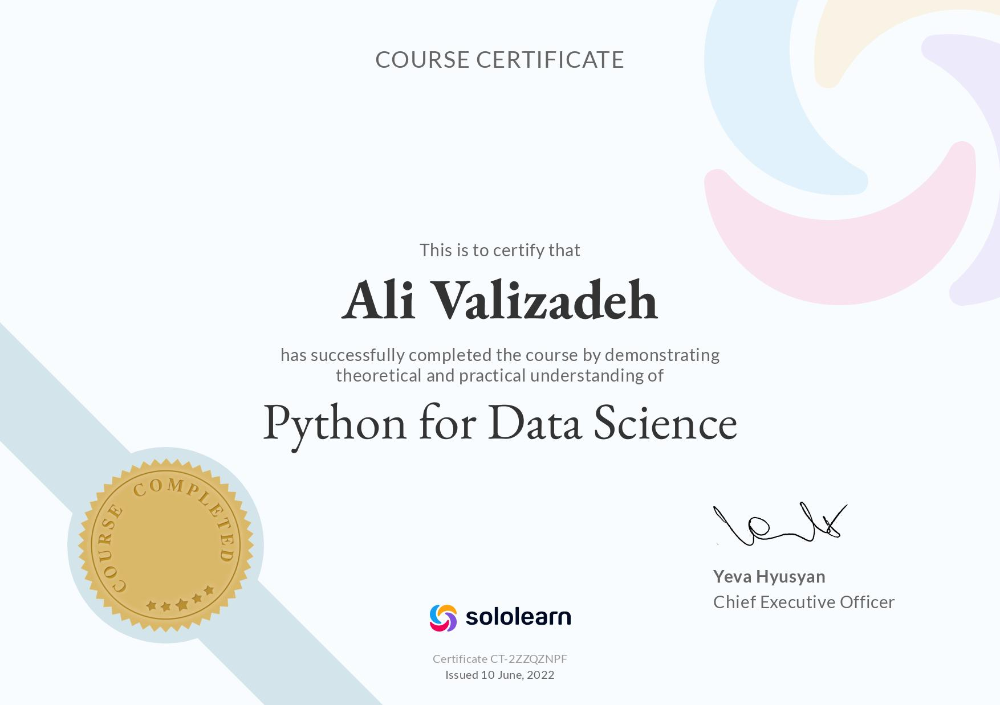
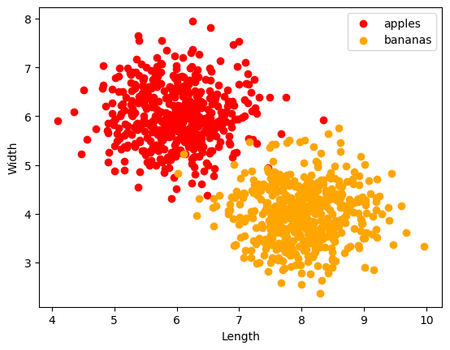
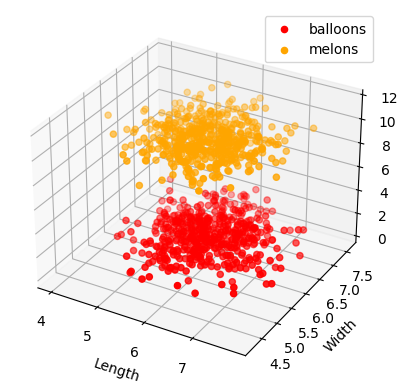
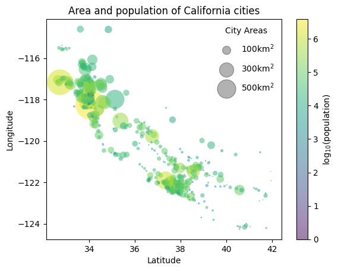

Assinment-38 of Data Science

- 
Certificate of Python for Data Science

---
- 
As data science is not a discipline traditionally taught at universities, contemporary data scientists come from diverse backgrounds such as engineering, statistics, and physics.

---
- 
Python classification (Banana and Apple)

---
- 
Python classification (Balloons and Melons)

---
- 
California cities problem

