
Assinment-40 of Data Science

 
 

- 
Analysis of the world's billionaires and their NetWorth

 

- Mean age of Billionaires = 63
- Variance age of Billionaires = 175.5
 
 

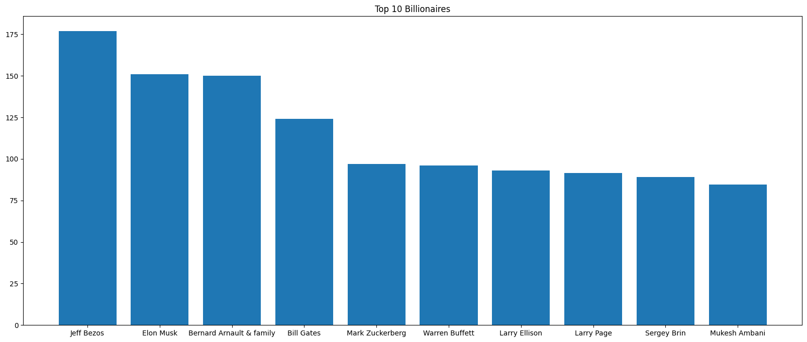
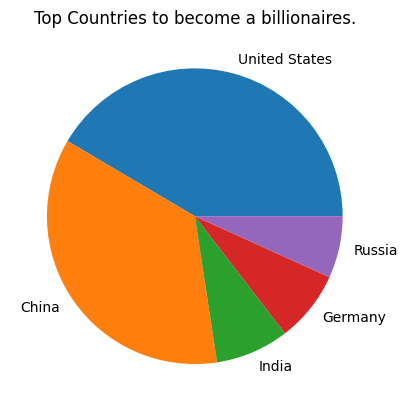
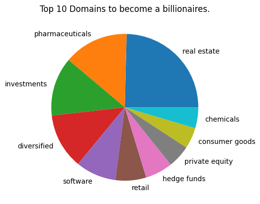
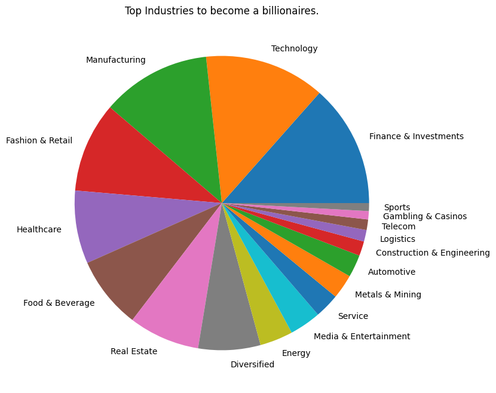

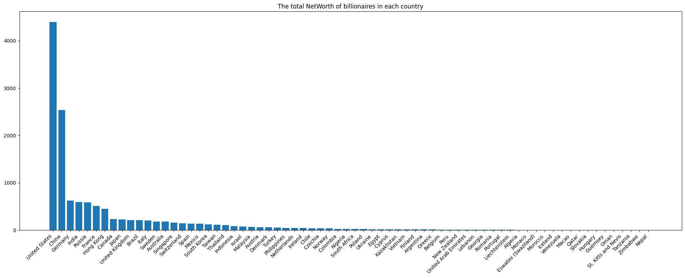

---
 
 
 

- 
Analysis of goals scored by Lionel Messi until 2019 🏃🏻‍♂️

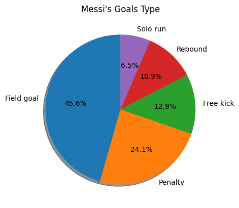
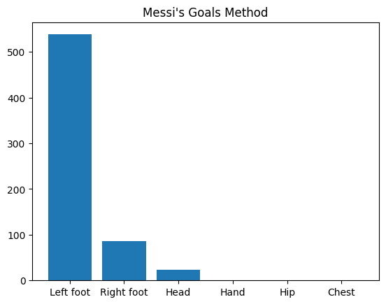
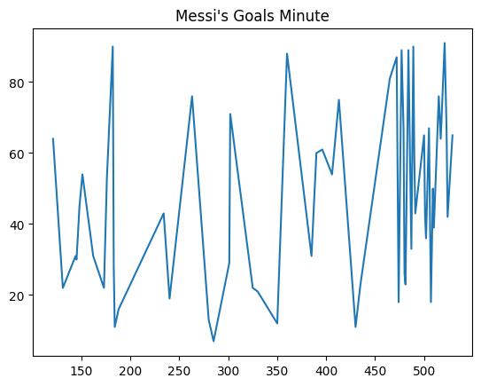
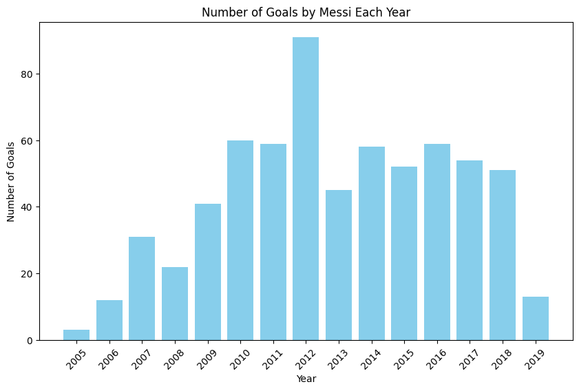
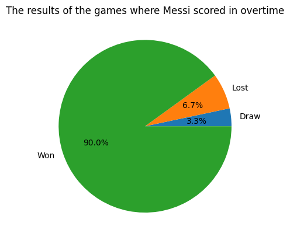
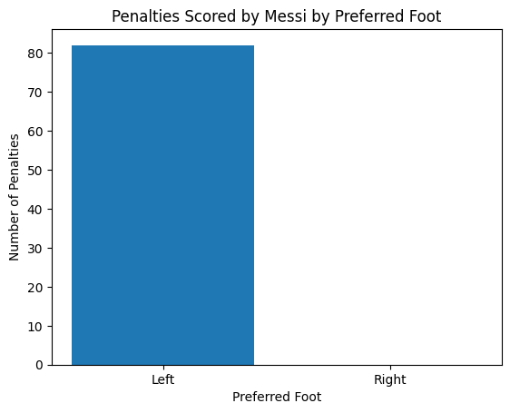

- percent of Draw goals = % 8.6
---
