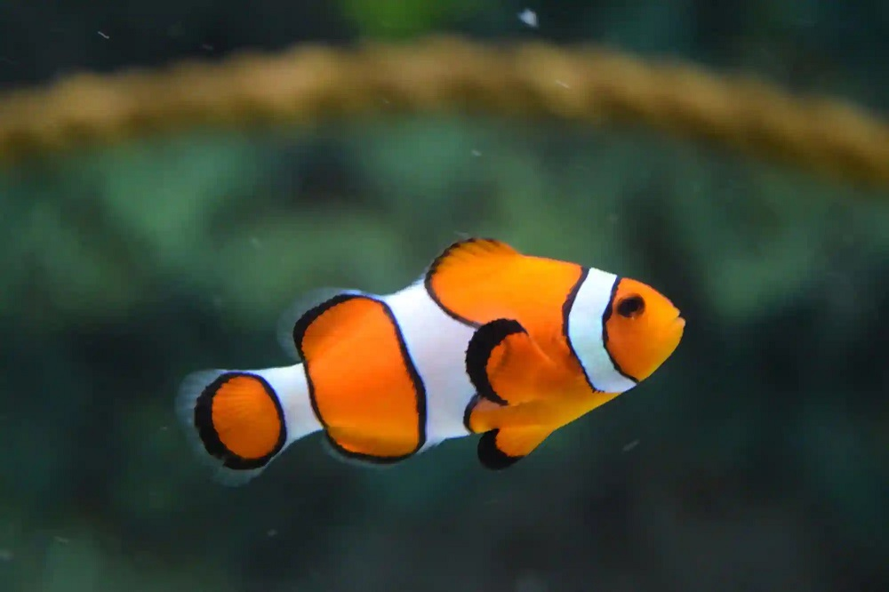

Assinment-43 (Machine Learning)

 
 

- 
Remove Nemo bg

 
 

 
 

 

- 
Remove Abji-Nemo bg.

 
 

 
 

 

- 
Remove Abji-Nemo bg with FindingNemo Class.

---
 

- 
Finding Dory

---
 

- 
IRIS dataset

