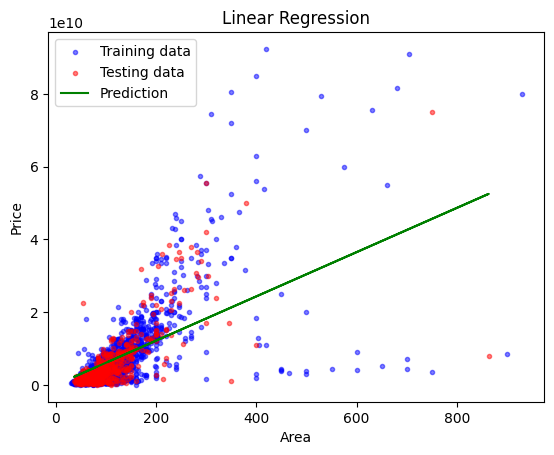
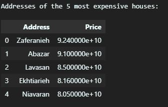
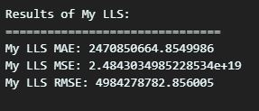
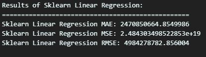
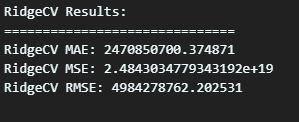

Assinment-45 (Machine Learning) Linear Least Squares (LLS)

 

- 
Tehran House Price 🏠

 

<ul>
Why the MSE metric is a very large number?

- 
MSE Metric: It’s usually large because it squares errors

</ul>

  

---

- 
Dollar Rial Price 💰

