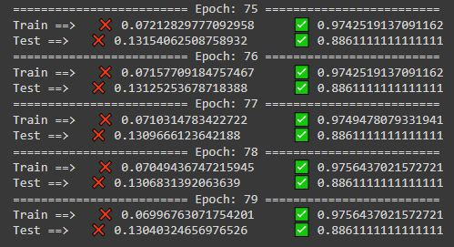
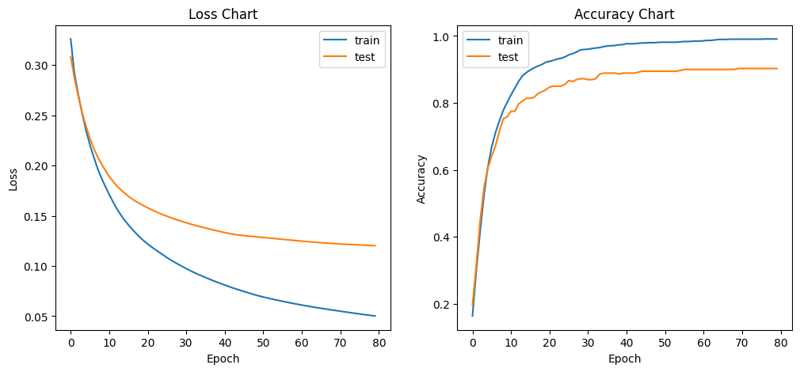

Assinment-48 (Machine Learning) Neural Networks

 

- 
Multi Layer Perceptron (MLP)

- 
Digits dataset

The result of ❌loss and ✅accuracy of 3-layer neural network for recognizing handwritten numbers in Train and Test data. 

