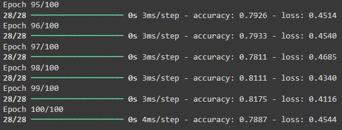
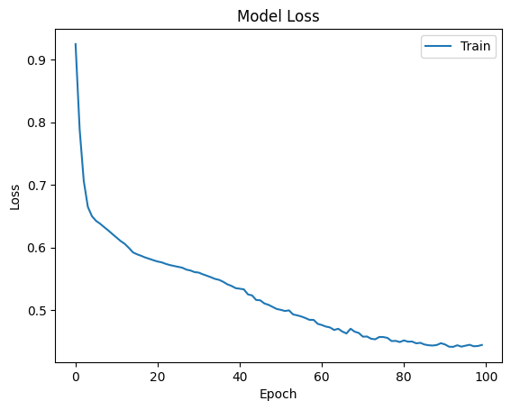
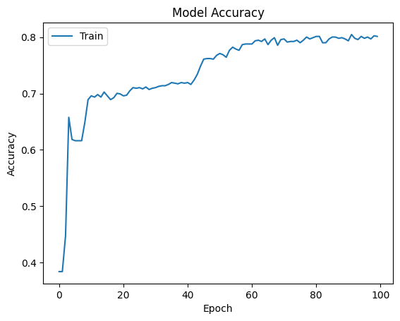
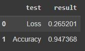
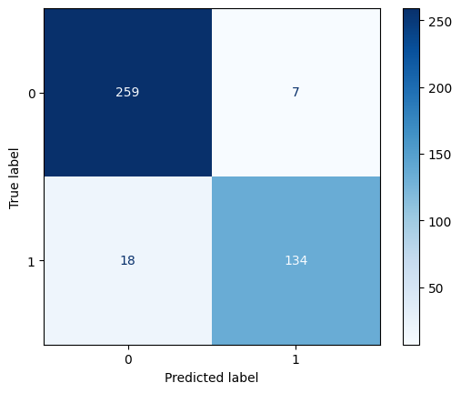
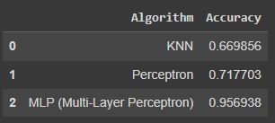

Assinment-49 (Machine Learning) Neural Networks

 

# 
MLP (Multi Layer Perceptron) using TensorFlow (TITANIC dataset)

- 
Fit MLP model on TITANIC train dataset

The results of calculating the accuracy and loss of the MLP algorithm in detecting the effective factors in saving the Titanic passengers 

- 
Draw Loss and Accuracy chart 

- 
Evaluate your model on test dataset (You should achieve an accuracy > 90%) 

- 
Calculate precision and recall 

---

Predict your model on Jack and Rose data 

- 
Jack's survival prediction: Did not survive

- 
Rose's survival prediction: Survived 

---
  

Comparing the accuracy of KNN, Perceptron and MLP algorithms 

