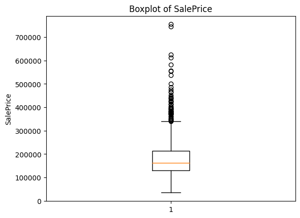
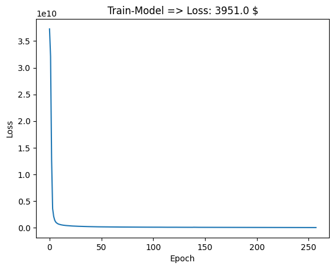

## Assinment-50 (Machine Learning) Neural Networks

<br>

# House Prices Prediction with TensorFlow

This repository contains a solution for the Kaggle House Prices dataset using TensorFlow for predicting house prices.

## Project Overview

The goal is to predict house prices based on various features available in the dataset. The model is trained using a neural network implemented in TensorFlow. Key steps include data preprocessing, Str-features encoding, model training, and evaluation.

## Dataset

The dataset used is from the [House Prices - Advanced Regression Techniques](https://www.kaggle.com/c/house-prices-advanced-regression-techniques) competition on Kaggle.

## Preprocessing

- Handled missing data by removing columns with more than 45% missing values.
- Replaced remaining missing values using mean or mode.
- Encoded categorical features using Target Encoding.
- Scaled numerical features using StandardScaler.

|index|Missing Count|Percentage|
|---|---|---|
|PoolQC|1453|0\.9952054794520548|
|MiscFeature|1406|0\.963013698630137|
|Alley|1369|0\.9376712328767123|
|Fence|1179|0\.8075342465753425|
|MasVnrType|872|0\.5972602739726027|
|FireplaceQu|690|0\.4726027397260274|
|LotFrontage|259|0\.1773972602739726|
|GarageYrBlt|81|0\.05547945205479452|
|GarageCond|81|0\.05547945205479452|
|GarageType|81|0\.05547945205479452|
|GarageFinish|81|0\.05547945205479452|
|GarageQual|81|0\.05547945205479452|
|BsmtFinType2|38|0\.026027397260273973|
|BsmtExposure|38|0\.026027397260273973|
|BsmtQual|37|0\.025342465753424658|
|BsmtCond|37|0\.025342465753424658|
|BsmtFinType1|37|0\.025342465753424658|
|MasVnrArea|8|0\.005479452054794521|
|Electrical|1|0\.0006849315068493151|
|Id|0|0\.0|



## Model

- A Sequential neural network with layers:
  - Dense layer with 73 units and sigmoid activation.
  - Dense layer with 128 units and ReLU activation.
  - Dense layer with 32 units and ReLU activation.
  - Output layer with 1 unit for house price prediction.

- Optimizer: Adam
- Loss: Mean Squared Error (MSE)



## Training

- Early stopping is applied to prevent overfitting.
- The model is trained on 80% of the data, with 20% reserved for validation.

## Evaluation

- RMSE is used as the evaluation metric.
- The model is evaluated on validation and test sets to assess performance.

```
  - Loss-MSE (Validation-test): 1247451136.0
  - Loss-RMSE (Validation-test): 35319.0
```

<br><br>


## Requirements

- Python 3.6+
- TensorFlow
- Pandas
- NumPy
- scikit-learn
- category_encoders
```bash
pip install -r requirements.
```

<br>

# How to Run

1. Clone the repository:

```bash
git clone https://github.com/your-username/house-price-prediction.git
cd house-price-prediction
```
2. Run the Jupyter Notebook or Python script.
3. Evaluate the model and make predictions on the test dataset.


